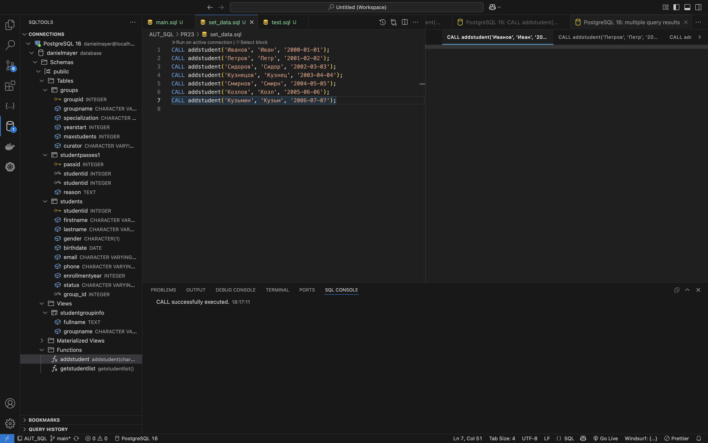

# Практическая работа №23

 
1. 
Тут я уже создал фунцию на скрине видно ее успешно создание

 
2. 
тут уже я вызвал несколько раз эту фунцию с разными параметрами

 
3. 
на этом скрине уже сама проверка успешности выполнения функции
показанно что все данные успешно добавлены