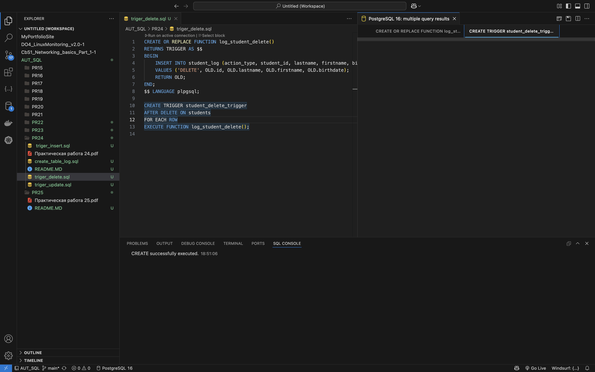
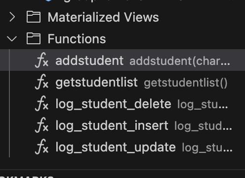
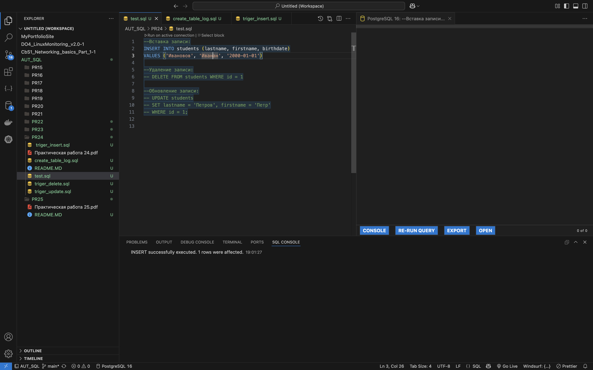
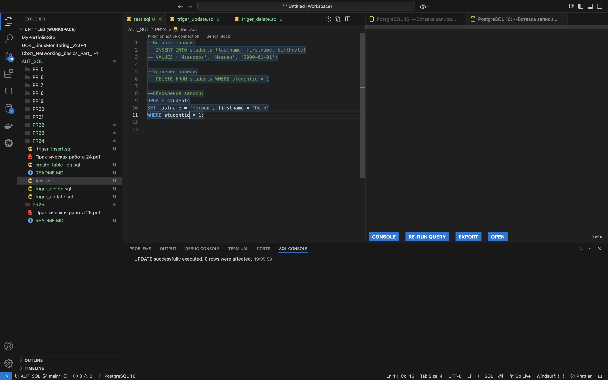
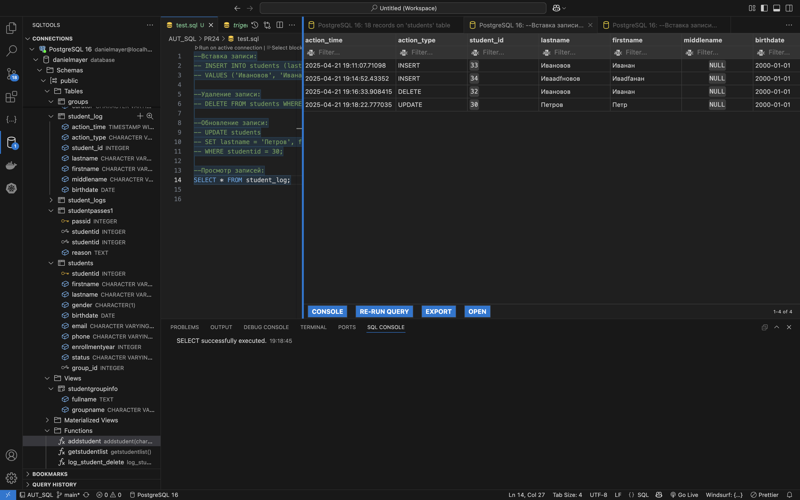

# Практическая работа №24

 
1. Создал таблицу для логирования

 
2. Сделал тригер для insert

 
3. Сделал тригер для update

 
4. Сделал тригер для delete

 
5. На скрине выдно созданные функции

 
 
 
6. На этих скринал я делал тест всех тригеров

 
7. Тут вывод таблицы в которой видны все изменения
