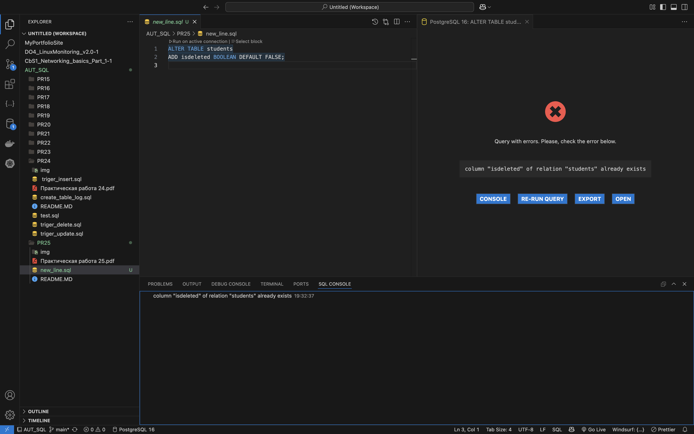
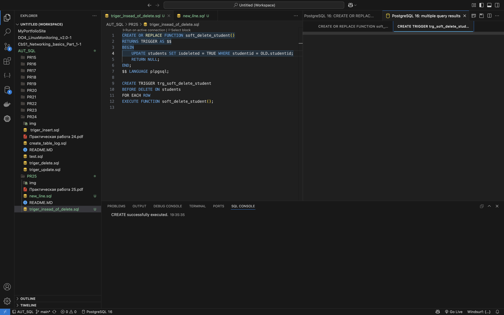
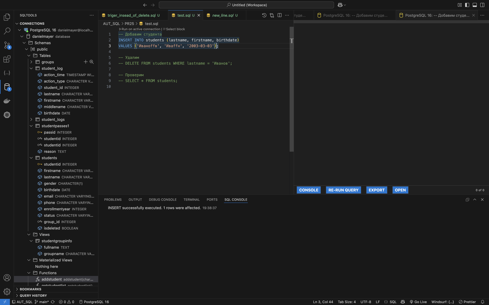
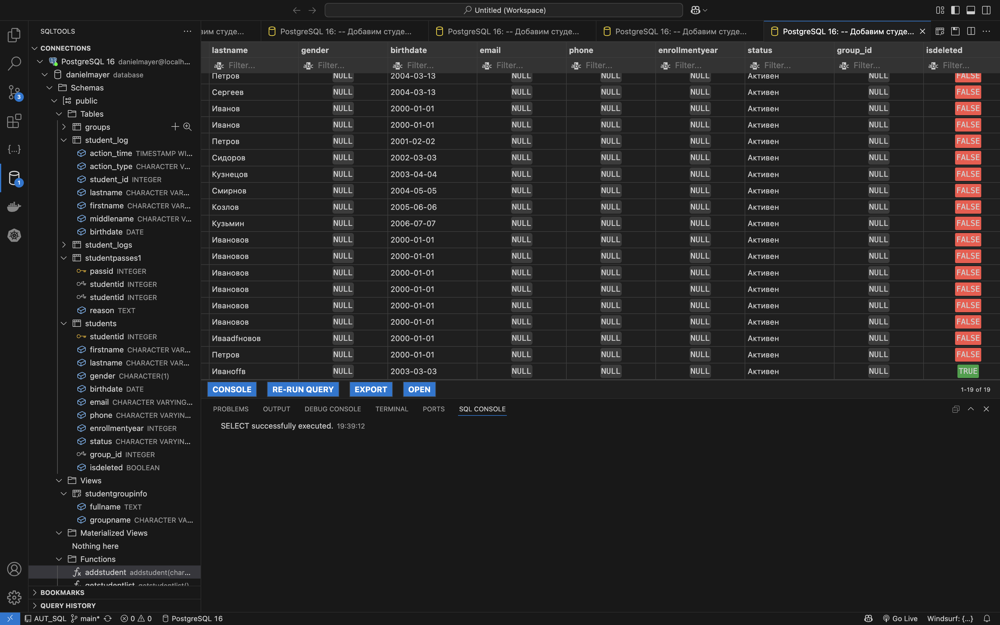

# Практическая работа №23

 
1. Создал новое поле для проверки

 
2. создал функцию и тригер

 
3. тут добавил нового студента для теста

 
4. тут удалил его

 
5. и тут уже на скрине видно что поле поменяло свое значение на true 